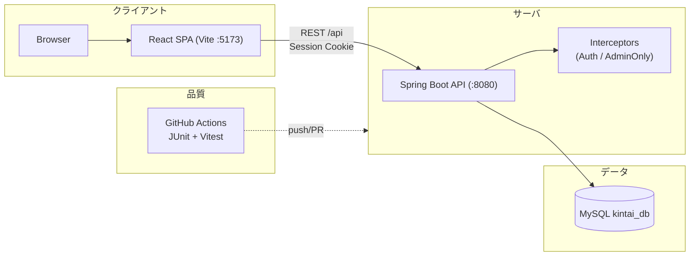

# PPT_reference.md（発表用・章立てテンプレ／kintai）

このファイルは、下記の章立て（1〜8）に沿って **そのままPPT化できる** ように、スライドに載せる要点と発表時に話す補足（スピーカーノート）をまとめた参照資料です。  
根拠は `README_jp.md` / `README_kr.md` / `docs/system-design-overview.md` / `docs/project-comprehensive-report.md` 等の現行リポジトリ記載に準拠しています。

---

## 0. まず最初に（表紙・自己紹介）

- **タイトル**: 勤怠管理システム「kintai」— 勤怠 + 社内協業 Webアプリ
- **一言**: React SPA + Spring Boot API + MySQL の業務システムを、教育用プロトタイプとして設計・実装
- **発表者**: [氏名] / [役割] / [チーム]

**スピーカーノート**
- 今日の話は「何を作ったか」より、**業務要件→設計→実装→品質→課題対応**の流れが伝わるように説明します。

---

## 1. プロジェクト概要

### 1.1 背景・目的

- **背景**: 勤務情報を月次で管理し、管理者が集計・運用できる仕組みが必要
- **目的**: 教育・実務型プロトタイプとして、業務システム開発（設計〜実装〜テスト）を一通り経験
- **対象ユーザー**: 従業員（入力）／管理者（集計・運用）

**スピーカーノート**
- いわゆる「勤怠入力＋集計」に加え、運用上よく欲しくなる **協業機能（掲示板・メッセンジャー）** と **休暇申請** まで入れて、実務感のある構成にしています。

### 1.2 期間・体制

- **期間**: 約1か月（トレーニング条件の想定）
- **体制**: 3名チーム想定
- **進め方**: 画面・API・DBを並行しつつ、CIでテストを回す

**スピーカーノート**
- 短期なので、最初に「役割と責務の境界（フロント/バック/DB）」を明確化し、後半の手戻りを減らす方針にしました。

### 1.3 ゴール

- **ゴール**: 「ログイン → 勤怠入力 → 月次確認 → 管理者集計」まで一連が動く
- **運用目線**: 権限（ADMIN/EMPLOYEE）、ログ（ログイン試行）、取込（Excel）、レポート（PDF）も用意
- **品質目線**: CIでバック/フロントのテストが自動実行

---

## 2. システム概要

### 2.1 全体像



- **アーキテクチャ**: SPA（React）↔ REST API（Spring Boot）↔ MySQL
- **認証**: HTTPセッション（Cookie）で `/api` を保護
- **開発体験**: Viteのプロキシで `/api` をバックエンドへ転送

**スピーカーノート**
- フロントは `axios` で `withCredentials: true`、バックはインターセプタでセッション必須を強制し、役割は `@AdminOnly` 相当で二重化しています（UI分岐＋API側の防御）。

### 2.2 構成（技術スタック）

- **バックエンド**: Java 17 / Spring Boot 3.2系 / Spring Data JPA / Flyway / MySQL
  - Excel: Apache POI、PDF: OpenPDF、Mail、Validation、Crypto（パスワードハッシュ等）
- **フロントエンド**: React 18 / Vite 5 / React Router / Axios / Chart.js / xlsx
- **CI**: GitHub Actions（backend: JUnit、frontend: Vitest）

### 2.3 機能（ユーザー別）

- **EMPLOYEE（従業員）**
  - 勤怠入力（出退勤・休憩・備考）／勤務履歴（月次）
  - 休暇申請・取消
  - 掲示板（閲覧・投稿・コメント）、メッセンジャー（1:1）
- **ADMIN（管理者）**
  - 社員マスタ、ログイン試行履歴
  - 勤怠の全体照会、Excel取込、統計、ダッシュボード
  - レポート（PDFプレビュー/出力）、休暇承認/却下

**スピーカーノート**
- “勤怠”を中心にしつつ、管理運用で必要な「取込・集計・監査（ログ）」を揃えた構成です。

---

## 3. 開発概要

### 3.1 担当（例：あなた用に調整して使用）

> ※実際の担当に合わせて、当てはまるものを残してください。

- **バックエンド**
  - セッション認証、権限（ADMIN/EMPLOYEE）、インターセプタ
  - 勤怠API（CRUD / bulk / 月次取得）、Excel取込、PDF出力、Flyway運用
- **フロントエンド**
  - ルーティング/PrivateRoute、Axiosセッション連携
  - 管理者画面（統計/ダッシュボード）や未読バッジ等のUI
- **チームで担当**
  - 掲示板/メッセンジャー/休暇などの機能分担、設計ドキュメント整備

**スピーカーノート**
- ここは面接・発表で突っ込まれやすいので、**自分が触った箇所を具体的な“機能名/API名”で言う**のが安全です。

### 3.2 実装（どう作ったか：流れで説明）

- **API設計 → DTO/Service → DB（Flyway）** の順で整合を取りながら実装
- 認証は **セッション**、管理者専用は **AdminOnly** の考え方で防御
- フロントはページ単位（`pages/`）に責務を分け、APIは `api/` に集約

### 3.3 工夫（このプロジェクト固有のハイライト）

- **業務ルール変更に強い**: Flywayでスキーマ変更を履歴化（例：外出区間など）
- **未読バッジ**: `GET /api/messenger/unread-count` をメニュー表示に反映
- **月次指標の警告**: 閾値超過の注意/警告メッセージで運用気づきを支援

---

## 4. 成果物

### 4.1 設計

- **システム設計概観**: `docs/system-design-overview.md`（Mermaidで構成/認証/ER）
- **モジュール/データ/IF設計**: `docs/モジュール_設計.md`, `docs/データ_설계.md`, `docs/인터페이스_설계.md`
- **SQL**: `sql/schema.sql`（手動DDL例）、正本はFlyway（`backend/src/main/resources/db/migration`）

### 4.2 開発物

- **バックエンド**: `backend/`（Spring Boot REST API）
- **フロント**: `frontend/`（React SPA）
- **主要API（例）**
  - 認証: `/api/auth/*`
  - 勤怠: `/api/worktime*`
  - 掲示板: `/api/board*`
  - メッセンジャー: `/api/messenger*`
  - 休暇: `/api/vacations*`

### 4.3 テスト

- **バックエンド**: JUnit（例：勤怠の重複検証、CSV取込など）
- **フロント**: Vitest（例：時間フォーマット）
- **CI**: `.github/workflows/tests.yml` で push/PR 時に自動実行

**スピーカーノート**
- “全部を網羅してます”より、「重要な業務ロジックにテストを置いた」説明が有効です（勤怠の整合性や取込の例外系など）。

---

## 5. 技術課題と対応

### 5.1 課題①：セッション認証・権限設計（401/403の切り分け）

- **課題**: UIだけの分岐だと直叩きで突破される／エラーが曖昧になりがち
- **対応**: API側で **AuthInterceptor**（未認証401）＋ **AdminOnly**（権限不足403）で防御
- **結果**: 画面遷移のUXを維持しつつ、APIの安全性を確保

### 5.2 課題②：Excel取込の“揺れ”とエラー扱い

- **課題**: フォーマット差・空欄・時刻型などで取込が壊れやすい
- **対応**: POIでのパース＋バリデーション、エラー行を集計して返却（成功/失敗を可視化）
- **結果**: “何が何件失敗したか”を画面で説明できる取込体験

### 5.3 課題③：業務ルール変更への追従（外出区間・月次警告）

- **課題**: 勤怠は仕様変更が起きやすい（例：外出を複数区間で扱う）
- **対応**: FlywayでDB変更を履歴化し、影響範囲（API/集計/UI）を段階的に反映
- **結果**: 既存データ整合を壊しにくく、レビューもしやすい

---

## 6. 改善点（次に直すなら）

### 6.1 設計

- **OpenAPI（Swagger）** を導入してAPI仕様を自動生成
- 権限境界（どのAPIが誰に見えるべきか）を **一覧表で固定**（設計書→実装のズレ防止）

### 6.2 開発

- フロントの状態管理（ローディング/エラー）を共通化して重複を削減
- 取込やPDFなどI/O系の **境界テスト** を増やす（ファイル形式の差分に強く）

### 6.3 運用

- セッションタイムアウト、アップロード上限、ログ保管方針などを運用パラメータ化
- 監査用途でログイン試行以外の重要操作（承認/削除等）も履歴化

---

## 7. 今後の計画

### 7.1 技術

- Docker化（DB含む）で環境差分を減らす
- 権限をロールだけでなくスコープ（部署/プロジェクト）へ拡張できる設計に

### 7.2 開発力

- 要件→設計→テストのトレーサビリティ（仕様変更に強い運用）
- “例外系”を先に決める（取込失敗・権限不足・セッション切れ）

### 7.3 ビジネス

- 月次集計（残業/休日/有休）をKPI化し、管理者の意思決定を支援
- CSV/会計など外部連携を見据えたエクスポート機能

---

## 8. まとめ

### 8.1 成果

- 勤怠入力〜管理者集計までを、SPA+API+DBの構成で一通り実装
- 協業機能（掲示板/メッセンジャー）と休暇申請で運用シーンを補完
- CIでテストを自動実行し、最低限の品質ゲートを用意

### 8.2 学び

- 認証/権限はUIだけでなく **API側で必ず防御**する重要性
- 業務ルール変更に備え、DB移行（Flyway）と影響範囲整理が効く
- 取込・PDFなどI/Oは“動く”だけでなく **失敗の見せ方**が大事

### 8.3 今後

- 仕様の明文化（OpenAPI）と運用パラメータ化で保守性を上げる
- テストの拡充（取込/権限/集計の境界条件）

---

## 付録A. デモ手順（発表で1枚に貼る用）

### バックエンド（既定ポート 8080）

```powershell
Set-Location backend
.\gradlew.bat bootRun
```

### フロントエンド（既定ポート 5173）

```powershell
Set-Location frontend
npm install
npm run dev
```

ブラウザ: `http://localhost:5173`

---

## 付録B. 30秒締めコメント（読み上げ用）

「kintaiは、ReactのSPAとSpring BootのREST API、MySQLを組み合わせた勤怠管理の教育用プロトタイプです。  
セッション認証とADMIN/EMPLOYEEの権限分離を軸に、勤怠入力・集計に加えて掲示板やメッセンジャー、休暇申請まで含めて運用を想定した構成にしました。  
今後はOpenAPIによる仕様の固定化と、取込・集計の境界条件テストを強化して、変更に強いシステムへ改善していきます。」

