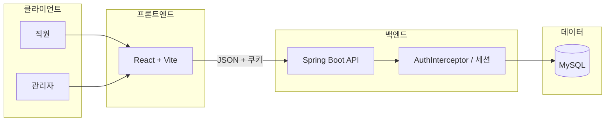
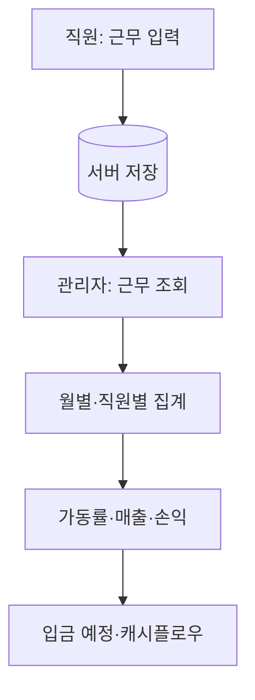
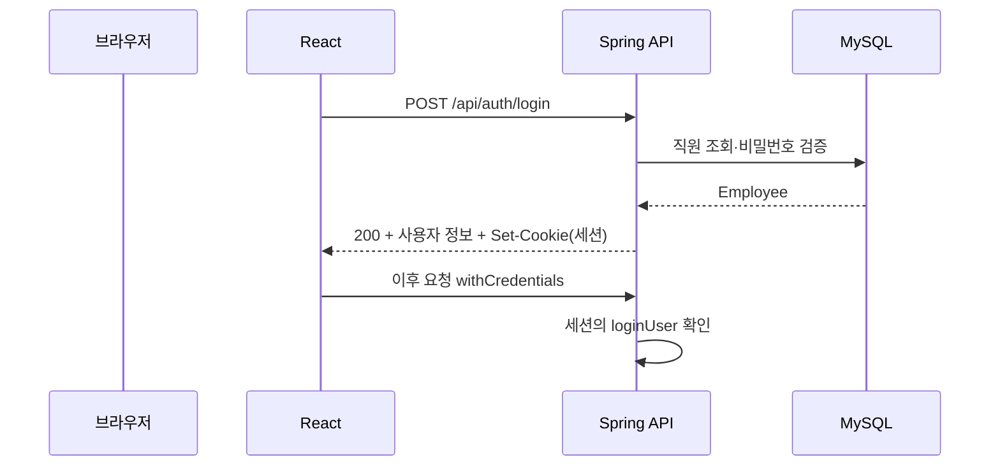
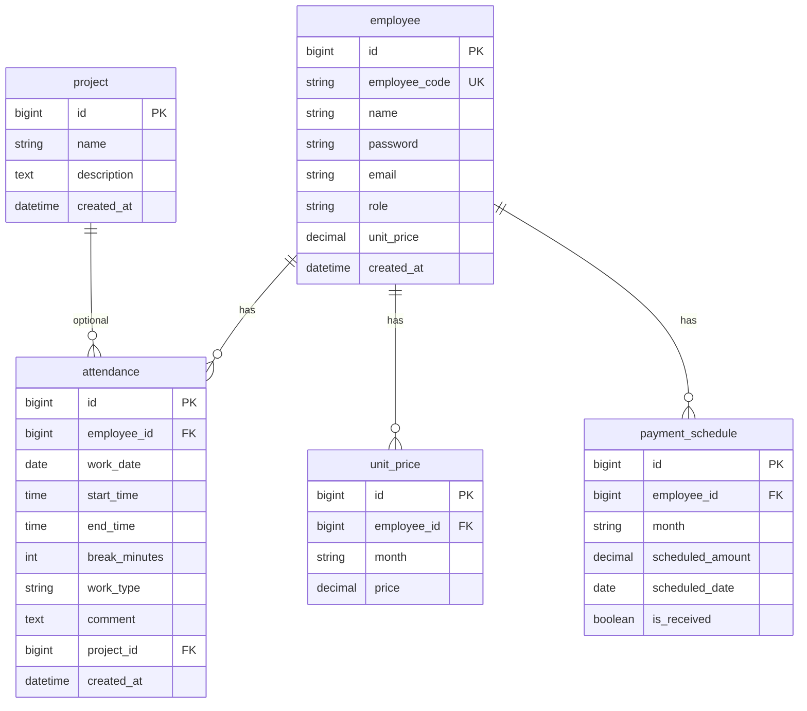

# 근태관리 시스템 (Kintai) — README2

교육용 **근태 · 가동 · 손익** 통합 웹 시스템입니다.  
기존 [README.md](README.md)의 요건·개요를 유지하면서, **구조·흐름·데이터 관계**를 그림으로 정리한 문서입니다.

---

## 1. 한눈에 보는 구성 (ASCII)

```
                    ┌─────────────────────────────────────────┐
                    │              사용자 브라우저              │
                    │   React (Vite)  http://localhost:3000     │
                    └───────────────────┬─────────────────────┘
                                        │  /api/*  (프록시)
                                        ▼
                    ┌─────────────────────────────────────────┐
                    │         Spring Boot 3 + Tomcat         │
                    │         http://localhost:8080          │
                    │   REST API · 세션 쿠키 · BCrypt         │
                    └───────────────────┬─────────────────────┘
                                        │  JDBC
                                        ▼
                    ┌─────────────────────────────────────────┐
                    │              MySQL 8 (kintai_db)         │
                    └─────────────────────────────────────────┘
```

---

## 2. 시스템 맥락도 (Mermaid)



---

## 3. 업무 흐름 (Mermaid)



---

## 4. 인증 흐름 (로그인 예시)



회원가입(`POST /api/auth/register`) 성공 시에도 세션이 설정되어 바로 직원 화면으로 이어질 수 있습니다.

---

## 5. 화면·라우팅 구조

```mermaid
flowchart TB
  subgraph public["공개"]
    L[/login]
    REG[/register]
  end

  subgraph emp["직원"]
    WI[work-input]
    WH[work-history]
  end

  subgraph adm["관리자"]
    D[dashboard]
    WV[work-view]
    ST[statistics]
    RV[revenue]
    CF[cashflow]
  end

  L --> WI
  L --> D
  REG --> WI
```

| 경로 | 설명 | 권한 |
|------|------|------|
| `/login` | 로그인 | 공개 |
| `/register` | 직원 회원가입 | 공개 |
| `/work-input`, `/work-history` | 근무 입력·이력 | 직원 |
| `/dashboard` ~ `/cashflow` | 대시보드·통계·매출·캐시플로우 | 관리자 |

---

## 6. ER 다이어그램 (개념)

JPA 엔티티 및 [sql/schema.sql](sql/schema.sql) 과 대응합니다.



---

## 7. 기술 스택

| 구분 | 기술 |
|------|------|
| 백엔드 | Java 17, Spring Boot 3, Spring Data JPA, BCrypt |
| 프론트 | React 18, React Router 6, Axios, Vite 5, Chart.js |
| DB | MySQL 8 |
| API | REST, JSON, 세션 쿠키 (`withCredentials`) |

---

## 8. 저장소 디렉터리 요약

```
kintaikanlisystem_project/
├── backend/                 # Spring Boot
│   └── src/main/java/com/kintai/
│       ├── entity/          # JPA 엔티티
│       ├── controller/      # REST
│       ├── service/
│       └── config/          # CORS, 인터셉터, DataInitializer 등
├── frontend/                # Vite + React
│   └── src/
│       ├── pages/
│       ├── components/
│       ├── context/
│       └── api/
├── sql/
│   └── schema.sql           # DDL (수동 적용용)
├── README.md                # 요건·개요 원문
└── README2.md               # 본 문서
```

---

## 9. 로컬 실행 요약

1. **MySQL**  
   - DB 생성·테이블: [sql/schema.sql](sql/schema.sql) 실행 또는 앱의 `spring.jpa.hibernate.ddl-auto` 로 자동 반영.  
   - `application.properties` 의 URL·계정·비밀번호를 본인 환경에 맞게 설정.

2. **백엔드**  
   - `backend` 에서 Spring Boot 메인 클래스 실행 (포트 기본 **8080**).

3. **프론트**  
   - `frontend` 에서 `npm install` 후 `npm run dev` → **http://localhost:3000**  
   - `/api` 는 Vite 프록시로 **8080** 에 전달됩니다.

```text
  npm run dev  →  :3000  ──proxy──▶  :8080  ──▶  MySQL
```

---

## 10. 개발용 초기 계정 (DataInitializer)

서버 기동 시 직원 코드가 없으면 아래가 생성됩니다 (비밀번호는 BCrypt 저장).

| 구분 | 직원 코드 | 비밀번호 |
|------|-----------|----------|
| 관리자 | `admin` | `admin123` |
| 직원 샘플 | `emp001`, `emp002` | `emp123` |

추가 직원은 화면 **회원가입** 또는 DB/API 로 등록합니다.

---

## 11. README.md 와의 역할 분담

| 문서 | 역할 |
|------|------|
| [README.md](README.md) | 교육 목적, 요건 정의, 기능 목록 (텍스트 중심) |
| **README2.md** | 아키텍처·흐름·ER·실행 관계 (도식 중심) |

---

## 12. 참고

- 요건에 언급된 **Excel 업로드** 등은 README 범위에는 있으나, 구현 여부는 코드 기준으로 별도 확인이 필요합니다.  
- 인증은 현재 **세션 + 쿠키** 기반이며, README 에 적힌 대로 향후 JWT 등으로 확장 가능한 구조입니다.

GitHub·GitLab·VS Code 등에서 Mermaid 가 렌더링되지 않으면, 동일 내용을 [Mermaid Live Editor](https://mermaid.live) 에 붙여 확인할 수 있습니다.
