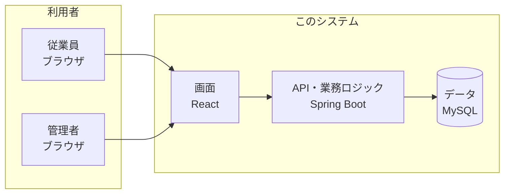
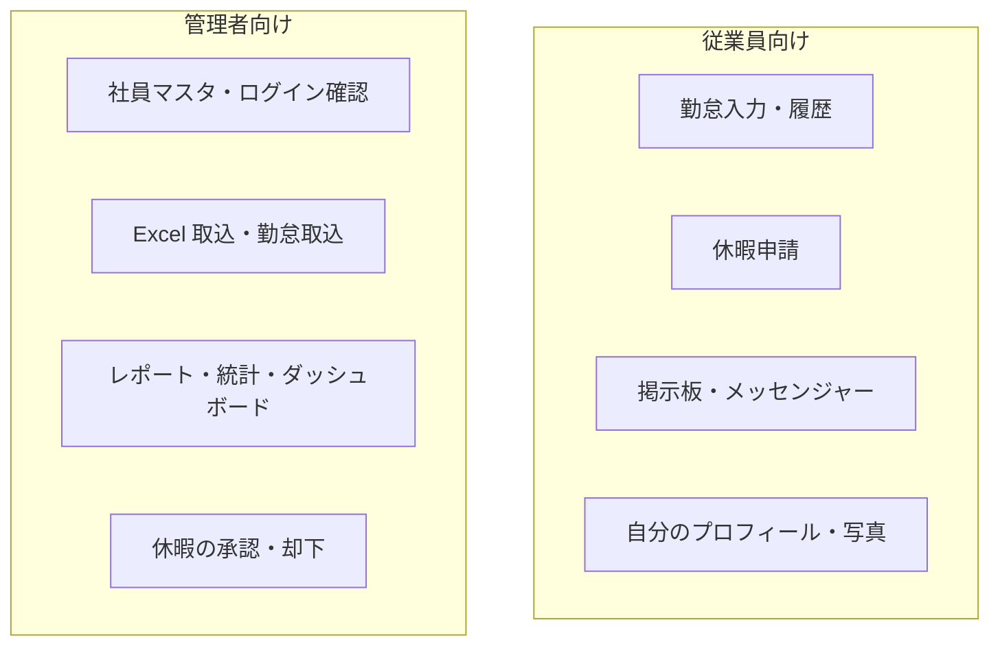
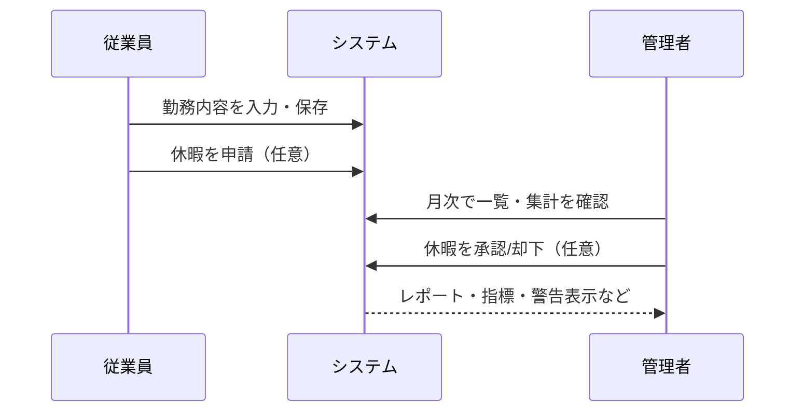
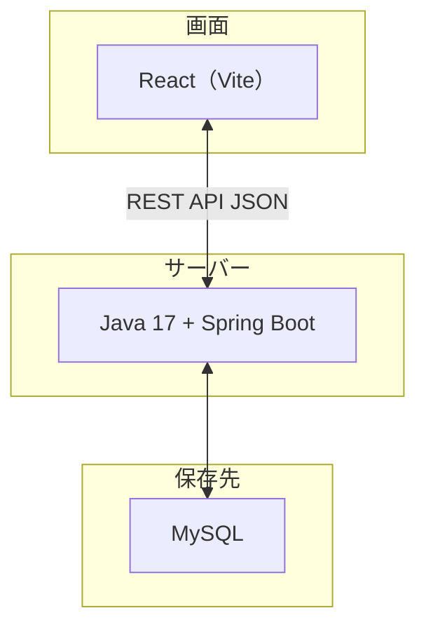
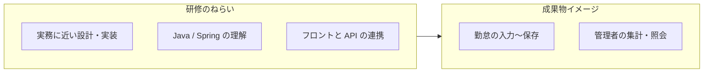

# 勤怠管理システム（kintai）

**一言でいうと:** 社員が勤務時間を入力し、管理者が月次で確認・集計できる **Web 上の勤怠アプリ** です。研修・実習用に作られた **Java（サーバー）＋ React（画面）** の構成です。

---

## この README の読み方

| あなたが… | まず読む場所 |
|-----------|----------------|
| **経営・企画・営業など技術に詳しくない方** | 次の「30 秒サマリー」と **図（Mermaid）** だけで十分です。 |
| **開発・運用をする方** | 図のあとにある「ローカル開発」「API 一覧」などを参照してください。 |

> **Mermaid 図について:** GitHub や VS Code / Cursor のプレビューでは図が表示されます。プレーンテキストで見る場合は、矢印や箱の意味だけ追えば大丈夫です。

---

## 30 秒サマリー（代表・非エンジニア向け）

1. **従業員** はブラウザから出退勤・休憩・コメントなどを入力し、**自分の履歴**や**休暇申請**、**掲示板・社内メッセンジャー**も使えます。  
2. **管理者** は全員分の勤怠を見たり、Excel 取込、レポート、統計、休暇の承認などができます。  
3. データは **会社のサーバー（または開発 PC）上のデータベース（MySQL）** に保存されます。  
4. ログインは **ID・パスワード**、必要に応じて **2 段階認証（TOTP）** も使えます。

---

## 図で見る全体像

### システムの置き方（誰が何に触れるか）



### 役割の違い（ざっくり）



### 業務の流れ（イメージ）



### 技術スタック（名前だけ知れば十分な方向け）



---

## 現在実装されている機能（一覧レベル）

### 認証・権限

- **セッション認証**（ログインでサーバー側にセッション）
- **TOTP（2FA）** 任意で有効化可能（`/api/auth/totp/*`）
- **ロール:** `ADMIN`（管理） / `EMPLOYEE`（一般）

### 画面のルート（フロント）

`frontend/src/App.jsx` 基準の要点だけ:

- ログイン後の既定: **管理者・従業員とも `/menu`**
- **共通:** ログイン、掲示板、メッセンジャー、休暇申請（自分分）
- **従業員:** 勤怠入力 `/work-input`、勤務履歴 `/work-history`（管理者が `/work-input` に入ると `/menu` に飛ばされます）
- **管理者:** 社員マスタ、ログイン試行確認、Excel アップロード、勤怠取込、レポート、ダッシュボード、勤務照会、統計、休暇管理 など

### バックエンド API（開発者向け・主要のみ）

詳細なパスはコードが正です。代表例:

| 分類 | 例 |
|------|-----|
| 認証 | `POST /api/auth/login`, `logout`, `GET /api/auth/me` + TOTP 系 |
| 勤怠 | `GET/POST/PUT/DELETE /api/worktime`、一括 `bulk`、Excel 取込、月次レポート送信 など |
| 勤怠取込（管理） | `POST /api/attendance/import`, `GET .../summary` |
| 統計・指標 | `GET /api/statistics/monthly`, `GET /api/admin/attendance-metrics` |
| 社員・写真・プロフィール | `/api/employees/*` |
| 掲示板・メッセンジャー・休暇 | `/api/board/*`, `/api/messenger/*`, `/api/vacations/*` |

<details>
<summary>開発者向け: エンドポイント詳細（展開）</summary>

コントローラ実装（代表）:

- **認証:** `POST /api/auth/login`, `POST /api/auth/logout`, `GET /api/auth/me`
  - **TOTP:** `POST /api/auth/totp/verify`, `POST /api/auth/totp/enroll`, `GET /api/auth/totp/setup`, `POST /api/auth/totp/enable`, `POST /api/auth/totp/disable`, `GET /api/auth/totp/status`
- **勤怠（WorkTime）:**
  - `GET /api/worktime?month=YYYY-MM[&employeeId=...]`（管理者は従業員指定可）
  - `GET /api/worktime/metrics?month=YYYY-MM[&employeeId=...]`（月次指標・警告用）
  - `POST /api/worktime`, `PUT /api/worktime/{id}`, `DELETE /api/worktime/{id}`
  - `POST /api/worktime/bulk`（月間の一括保存／上書き）
  - `POST /api/worktime/import-kintaihyo`（管理者のみ、勤務表 Excel 取込）
  - `POST /api/worktime/send-monthly-report`（従業員実行 → 管理者へ月次レポート送信）
- **勤怠取込・サマリー（管理者、`/api/attendance`）:**
  - `POST /api/attendance/import`（ファイルアップロード）
  - `GET /api/attendance/summary?month=YYYY-MM`
- **統計（管理者）:** `GET /api/statistics/monthly?month=YYYY-MM`
- **管理者向け月次勤怠指標**（残業・休日労働・深夜等）: `GET /api/admin/attendance-metrics?month=YYYY-MM`（クエリ: `standardMonthlyMinutes`, `employeeId` 等）
- **社員マスタ（管理者）:** `/api/employees/*`（登録/更新、招待メール、バッチ削除等）
- **社員写真（プロフィール）:**
  - `POST /api/employees/{id}/photo`（管理者アップロード）
  - `POST /api/employees/me/photo`, `DELETE /api/employees/me/photo`（本人）
  - `GET /api/employees/{id}/photo`（ログイン中ユーザーなら取得可能）
- **本人プロフィール（従業員・管理者共通）:** `GET /api/employees/me/profile`, `PATCH /api/employees/me/profile`
- **ユーザー一覧（メッセンジャー等）:** `GET /api/users`（ログイン済みユーザー全員）
- **掲示板:** `GET/POST /api/board`, `GET/PUT/DELETE /api/board/posts/{postId}`, `PATCH /api/board/posts/{postId}/pin`, コメント `POST /api/board/posts/{postId}/comments`, `DELETE /api/board/posts/{postId}/comments/{commentId}`
- **メッセンジャー:** `GET /api/messenger/conversations`, `GET /api/messenger/conversation/{partnerId}`, `POST /api/messenger/send`, `GET /api/messenger/unread-count`, 会話削除 `DELETE /api/messenger/conversation/{partnerId}` または `POST /api/messenger/conversation/{partnerId}/delete`
- **休暇:** `/api/vacations/*`
  - 従業員: `GET /api/vacations/my`, `POST /api/vacations`, `GET /api/vacations/balance`, `GET /api/vacations/{requestId}/attachment`, `DELETE /api/vacations/{requestId}`
  - 管理者: `GET /api/vacations?status=...`, `GET /api/vacations/balance/admin?employeeId=...`, `PUT /api/vacations/{requestId}/approve`, `PUT /api/vacations/{requestId}/reject`, `DELETE /api/vacations/{requestId}/admin`

**テスト範囲（例）:**

| 領域 | ファイル |
|------|----------|
| バックエンド | `WorkTimeServiceTest`, `LeaveBalanceServiceTest`, `AttendanceImportServiceCsvTest`, `TotpServiceVerifyTest`, `TotpPendingSetupStoreTest`, `AttendanceMetricsCalculatorTest`（`backend/src/test/java/com/kintai/...`） |
| フロント | `frontend/src/utils/timeFormat.test.js` |

</details>

#### 画面 URL の補足（掲示板）

- `/board/post/:postId` が **標準 URL**
- `/board/:postId` は旧 URL — 数値 ID の場合 **`/board/post/:postId` へリダイレクト**

---

## ローカル開発の実行方法

### 事前準備

- **Java 17**（JDK）
- **MySQL** — DB 名などは `backend/src/main/resources/application.properties` を参照
- Windows PowerShell ではコマンドの区切りに **`;`** を推奨（`&&` は環境によって失敗することがあります）

### バックエンド（既定ポート 8080）

`backend/` で:

```powershell
.\gradlew.bat bootRun
```

（Mac / Linux: `./gradlew bootRun`）

- 接続情報は **`application.properties`**。上書きは **`application-local.properties`**（gitignore）。サンプル: `application-local.example.properties`
- **開発用 `dev` プロファイル:** 詳細エラー・SQL ログ・追加マイグレーション用

```powershell
$env:SPRING_PROFILES_ACTIVE="dev"
.\gradlew.bat bootRun
```

- **本番向け `prod`:** `application-prod.properties` を参照

### フロントエンド（既定ポート 5173）

`frontend/` で:

```powershell
npm install
npm run dev
```

ブラウザ: `http://localhost:5173`

### ビルド・テスト

```powershell
Set-Location backend; .\gradlew.bat test
```

```powershell
Set-Location frontend; npm test
```

**CI:** push で [`.github/workflows/tests.yml`](.github/workflows/tests.yml) がバックエンド JUnit とフロント Vitest を実行。

---

## リポジトリ構成（概要）

| パス | 内容 |
|------|------|
| `backend/` | Spring Boot API |
| `frontend/` | React SPA |
| `sql/schema.sql` | 手動適用用 DDL・シード例 |
| `docs/` | 設計・デバッグメモなど |

---

## 研修用システムとしての位置づけ（補足）



- **目的:** 新入社員が業務に近い形で Web 勤怠を設計・実装・運用し、Java 系開発を学ぶこと。
- **シナリオ:** 従業員が入力 → サーバーに保存 → 管理者が月次・個人別に確認（将来要件で売上・損益なども文書上は拡張可能、と記載あり）。

---

## 要件定義書ベースの要約（1 段落）

要件を文書化し、設計・実装の基準にする。読者は新入開発者・講師・リーダー。非機能（同時ユーザー規模、応答、パスワードハッシュ、ログ方針など）と、要件定義・設計書・ソース・マニュアル等の成果物が想定されています。

---

## 言語について

画面・API メッセージは主に **日本語**。韓国語の説明は **`README_kr.md`** を参照。

---

## 最近の変更（ハイライト）

- **外出（複数回）:** 同一勤務日に複数区間を保存可能（`work_time_outing`）。旧ルール「外出 2 時間超は退勤扱い」は廃止。
- **メッセンジャー未読:** `GET /api/messenger/unread-count` でメニューにバッジ表示。
- **月次指標:** 残業・休日労働などが閾値超過時に画面上で注意・警告。

---

## 付録 — 要件定義スタイルの詳細リスト（参考）

<details>
<summary>クリックで展開（長い一覧です）</summary>

### A.1 概要

- 勤怠 + 稼働 + 損益管理の要件を定義し、以降の設計・実装の基準とする。
- 対象: 新入開発者、講師・レビュアー、開発リーダー。
- 開発条件の例: 期間 1 か月、人数 3 名、教育用。

### A.2 システム概要

- 従業員勤怠の一元管理、管理者による稼働率/売上/損益の確認、Java/Spring/React の実習。
- 環境: 従業員はモバイル/PC/Excel、管理者は PC、サーバーは Spring Boot + Tomcat。

### A.3 業務要件

- 全従業員の勤怠管理、事務所での集計業務。
- フロー: 従業員入力 → システム保存 → 管理者確認 → 指標計算。

### A.4 ユーザー要件

- 従業員: 自分のデータのみ。管理者: 全データ。

### A.5 機能要件

- **認証:** ログイン/ログアウト、ID/パスワード。
- **従業員:** 勤務日、開始/終了、休憩、コメント、履歴照会。
- **管理者:** 全体照会、従業員/月別検索。
- **集計:** 月次勤務時間、稼働率。
- **売上/損益:** 単価管理、売上計算、コスト入力、利益計算（要件次第で拡張の概念）。
- **キャッシュフロー:** 入金予定日、月次入金額（概念）。

### A.6 非機能要件

- **性能:** 同時ユーザー例 10 名、応答時間例 3 秒以内。
- **セキュリティ:** パスワードハッシュ、URL 直接アクセスの防止。
- **運用:** Tomcat 再起動による復旧、ログに基づく障害確認。

### A.7 技術・データ・制約・成果物・目標

- **技術:** Java/JavaScript、Spring/React、MySQL、Tomcat。
- **データ:** 従業員、勤怠、単価、入金予定（概念）。
- **制約:** 教育用のため機能最小化、短期完了、外部連動なし（概念）。
- **成果物:** 要件定義書、設計書、ソースコード、マニュアル。
- **目標:** 勤怠入力から集計まで動作、Spring の構造理解、実務開発フローの理解。

</details>
