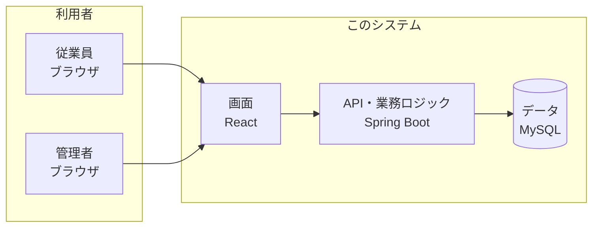
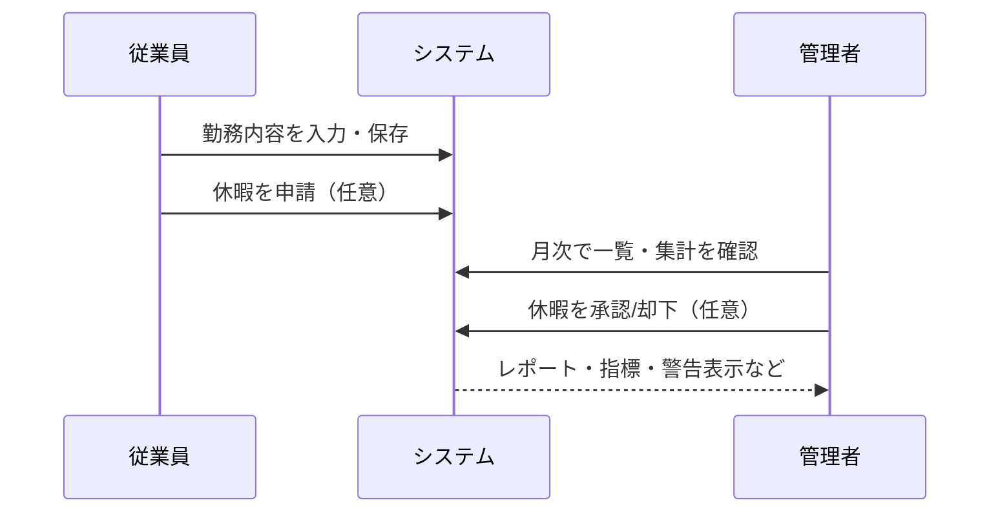
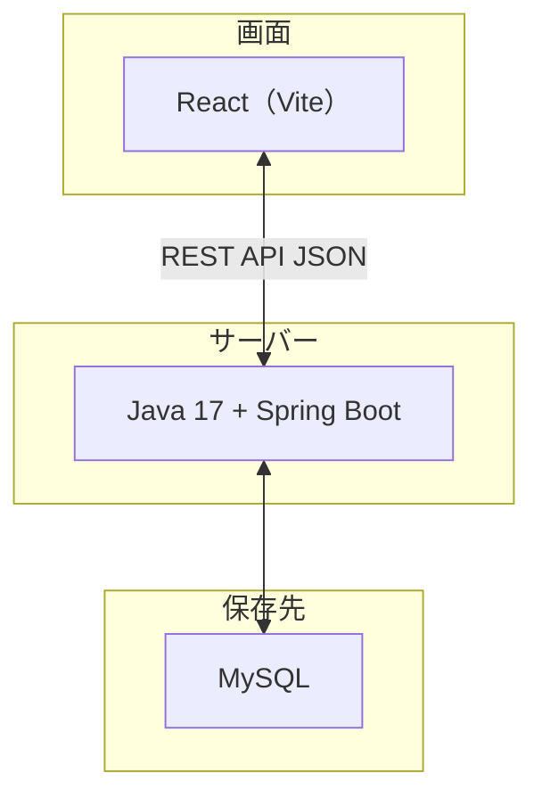
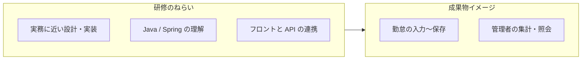

# 勤怠管理システム（kintai）

**一言でいうと:** 社員が勤務時間を入力し、管理者が月次で確認・集計できる **Web 上の勤怠アプリ** です。研修・実習用に作られた **Java（サーバー）＋ React（画面）** の構成です。

---

## 目次

1. [システム概要](#1-システム概要)
2. [図で見る全体像](#2-図で見る全体像)
3. [機能一覧](#3-機能一覧)
4. [ローカル開発の実行方法](#4-ローカル開発の実行方法)
5. [リポジトリ構成](#5-リポジトリ構成)
6. [要件定義](#6-要件定義)
7. [研修用システムとしての位置づけ](#7-研修用システムとしての位置づけ)

---

## 1. システム概要

1. **従業員** はブラウザから出退勤・休憩・コメントなどを入力し、**自分の履歴**や**休暇申請**、**掲示板・社内メッセンジャー**も使えます。
2. **管理者** は全員分の勤怠を見たり、Excel 取込、レポート、統計、休暇の承認などができます。
3. データは **MySQL** に保存され、ログインは **ID・パスワード**（必要に応じて **2 段階認証 / TOTP**）で行います。

画面・API メッセージは主に **日本語**。韓国語の説明は `README_kr.md` を参照。

---

## 2. 図で見る全体像

### システム構成（誰が何に触れるか）



### 業務の流れ



### 技術スタック



---

## 3. 機能一覧

### 認証・権限

- セッション認証（ログインでサーバー側にセッション）
- TOTP（2FA）任意で有効化可能（`/api/auth/totp/*`）
- ロール: `ADMIN`（管理） / `EMPLOYEE`（一般）

### 従業員向け

| 機能 | 画面 | 概要 |
|------|------|------|
| 勤怠入力 | `/work-input` | 出退勤・休憩・コメントの登録/修正 |
| 勤務履歴 | `/work-history` | 自分の月次勤怠一覧 |
| 休暇申請 | `/vacation` | 申請・取消・残数確認 |
| 掲示板 | `/board` | 投稿・閲覧・コメント |
| メッセンジャー | `/messenger` | 社内 1:1 メッセージ・未読バッジ |
| プロフィール・写真 | — | 自分の情報・顔写真の管理 |

### 管理者向け

| 機能 | 画面 |
|------|------|
| 社員マスタ | `/employees` |
| 勤務照会・統計 | `/work-view`, `/statistics`, `/dashboard` |
| Excel 取込・勤怠取込 | `/upload`, `/attendance-import` |
| 月次レポート | `/report` |
| 休暇管理（承認/却下） | `/vacation-manage` |
| ログイン試行確認 | `/login-check` |

> API の詳細（パス・メソッド・権限・エラー）は `docs/詳細設計書.md` を参照。

---

## 4. ローカル開発の実行方法

### 事前準備

- **Java 17**（JDK）
- **MySQL** — DB 名などは `backend/src/main/resources/application.properties` を参照
- Windows PowerShell ではコマンドの区切りに **`;`** を推奨（`&&` は環境によって失敗することがあります）

### バックエンド（既定ポート 8080）

`backend/` で:

```powershell
.\gradlew.bat bootRun
```

（Mac / Linux: `./gradlew bootRun`）

- 接続情報は **`application.properties`**。上書きは **`application-local.properties`**（gitignore）。サンプル: `application-local.example.properties`
- **開発用 `dev` プロファイル:**

```powershell
$env:SPRING_PROFILES_ACTIVE="dev"
.\gradlew.bat bootRun
```

### フロントエンド（既定ポート 5173）

`frontend/` で:

```powershell
npm install
npm run dev
```

ブラウザ: `http://localhost:5173`

### テスト・CI

```powershell
Set-Location backend; .\gradlew.bat test   # JUnit（バックエンド）
Set-Location frontend; npm test            # Vitest（フロントエンド）
```

push 時に `.github/workflows/tests.yml` が自動実行されます。

---

## 5. リポジトリ構成

| パス | 内容 |
|------|------|
| `backend/` | Spring Boot API |
| `frontend/` | React SPA |
| `sql/schema.sql` | 手動適用用 DDL・シード例 |
| `docs/system-design-overview_jp.md` | システム設計概要（日本語） |
| `docs/基本設計書.md` | 方式・画面・API 概要・ER 概要 |
| `docs/詳細設計書.md` | API/処理・テスト観点の詳細 |
| `docs/` | その他設計メモ一式 |

---

## 6. 要件定義

### 6.1 概要・目的

- 勤怠管理の要件を定義し、設計・実装の基準とする
- 対象: 新入開発者、講師・レビュアー、開発リーダー
- 開発条件: 期間 1 か月、人数 3 名、教育用

### 6.2 業務要件

- 従業員勤怠の一元管理、事務所での集計業務
- フロー: 従業員入力 → システム保存 → 管理者確認 → 指標計算

### 6.3 ユーザー要件

- **従業員**: 自分のデータのみ閲覧・操作
- **管理者**: 全データの照会・集計・取込・承認

### 6.4 機能要件

| 区分 | 要件 |
|------|------|
| 認証 | ログイン/ログアウト、ID/パスワード認証、TOTP（任意） |
| 勤怠（従業員） | 勤務日・開始/終了・休憩・コメントの入力、履歴照会 |
| 勤怠（管理者） | 全体照会、従業員/月別検索、Excel 取込、レポート |
| 協業 | 掲示板（投稿/コメント）、社内メッセンジャー |
| 休暇 | 従業員による申請、管理者による承認/却下 |
| 統計・集計 | 月次勤務時間、稼働率の集計・可視化 |

### 6.5 非機能要件

| 区分 | 要件 |
|------|------|
| 性能 | 同時ユーザー例 10 名、応答時間例 3 秒以内 |
| セキュリティ | パスワードハッシュ、セッション管理、管理 API の二重保護 |
| 運用 | Tomcat 再起動による復旧、ログに基づく障害確認 |

### 6.6 技術・制約・成果物

- **技術**: Java 17 / JavaScript、Spring Boot / React（Vite）、MySQL
- **制約**: 教育用のため機能最小化、短期完了、外部連動なし
- **成果物**: 要件定義書、設計書、ソースコード、マニュアル

---

## 7. 研修用システムとしての位置づけ



- **目的**: 新入社員が業務に近い形で Web 勤怠を設計・実装・運用し、Java 系開発を学ぶこと
- **シナリオ**: 従業員が入力 → サーバーに保存 → 管理者が月次・個人別に確認
