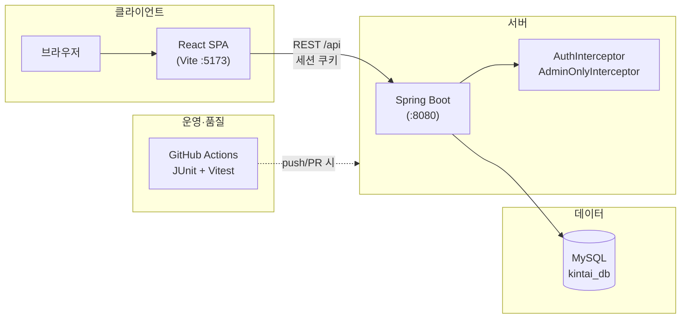
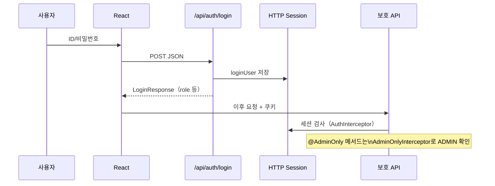
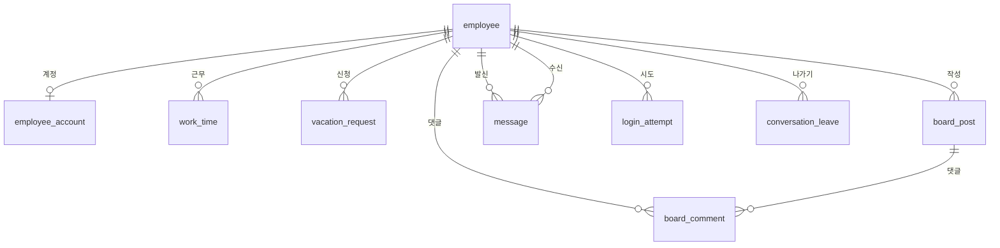

# kintai（근태 관리 시스템）— 시스템 설계 개요

**문서 목적**: 대표·내부 검토용으로 **구성·인증 개념·역할**을 **한 파일·짧은 시간**에 파악할 수 있게 합니다.  
**守備範囲（역할）**: 상세 API 정의·테이블 컬럼 정의는 **쓰지 않음**（`基本設計書.md` / `詳細設計書.md` / `データ_設計.md`로 안내）。본 문서의 API·데이터 절은 회의용 **목차 수준**으로 둡니다.  
**갱신**: 코드/요구가 바뀌면 본 문서를 함께 수정하는 것을 권장합니다.  
**다이어그램**: [Mermaid](https://mermaid.js.org/) 문법입니다. GitHub·Notion·VS Code 미리보기 등에서 렌더링됩니다.  
**문서 간 역할**: `docs/설계문서_역할_구분.md`

---

## 1. 프로젝트 한 줄 요약

| 항목 | 내용 |
|------|------|
| 이름 | kintai（勤怠）— 근태·사내 협업 웹 애플리케이션 |
| 목적 | 교육·실무형 프로토타입: 직원 근무 입력, 관리자 집계·운영 |
| 구성 | **React(Vite)** SPA + **Spring Boot** REST API + **MySQL** |
| 인증 | HTTP **세션**（`loginUser`）, 역할 **ADMIN** / **EMPLOYEE** |

---

## 2. 시스템 구성도

**로컬 개발**: 프론트 프록시로 `/api` → 백엔드（`vite.config.js`）.

---

## 3. 인증·권한 흐름（개념）

| 구성 요소 | 역할 |
|-----------|------|
| `AuthInterceptor` | `/api/**` 중 로그인 예외 경로 외 **미인증 → 401** |
| `AdminOnlyInterceptor` | `@AdminOnly`가 붙은 핸들러만 **ADMIN 아니면 403** |
| 프론트 `PrivateRoute` | UI 라우팅에서 로그인·관리자 메뉴 분기（최종 권한은 **백엔드**） |

---

## 4. 역할별 기능 매트릭스

| 구분 | EMPLOYEE（직원） | ADMIN（관리자） |
|------|------------------|-----------------|
| 근태 | 근무 입력, 본인 이력 | 전 직원 조회·Excel·리포트·통계 등 |
| 휴가 | 신청·취소·내역 | 목록·승인·거절 |
| 협업 | 게시판, 메신저 | 동일（일부 관리 API는 ADMIN） |
| 기타 | — | 직원 마스터, 로그인 시도 이력, 대시보드 등 |

**화면·API 메시지**: 주로 **일본어**（`README_kr.md` 참고）.

---

## 5. 주요 화면（라우트）요약

| 경로 | 대상 |
|------|------|
| `/login` | 공통 |
| `/work-input`, `/work-history` | 직원 |
| `/menu`, `/employees`, `/work-view`, `/statistics`, `/dashboard`, `/upload`, `/attendance-import`, `/report`, `/login-check`, `/vacation-manage` | 관리자 중심 |
| `/board`, `/board/:postId`, `/messenger`, `/vacation` | 로그인 사용자 |

（상세: `frontend/src/App.jsx`）

---

## 6. API 그룹（대표）

| 영역 | Base path | 비고 |
|------|------------|------|
| 인증 | `/api/auth` | login, logout, me |
| 근태 | `/api/worktime` | 월 조회, CRUD, bulk, Excel取込（관리）, 월간レ포트送信 |
| 직원·사진 | `/api/employees` | 마스터 CRUD, 사진 업로드/조회 |
| 게시판 | `/api/board` | 글·댓글 |
| 메신저 | `/api/messenger` | 대화 목록, 메시지, 전송, 미읽음, **대화 나가기**（POST `.../conversation/{id}/delete` 등） |
| 휴가 | `/api/vacations` | my, 신청, 취소, 관리자 목록·승인·거절 |
| 기타 | `/api/attendance`, `/api/reports`, `/api/statistics`, … | README 및 컨트롤러 참조 |

---

## 7. 데이터 개요（ER 개념）

물리 테이블명·제약은 Flyway `backend/src/main/resources/db/migration` 이 정본입니다. 아래는 **엔티티 관계 개념**입니다.

| 엔티티（테이블） | 설명 |
|------------------|------|
| `employee` | 직원 마스터 |
| `employee_account` | 로그인 ID·역할 등 |
| `work_time` | 일별 근무 기록 |
| `vacation_request` | 휴가 신청·승인 상태 |
| `board_post` / `board_comment` | 게시판 |
| `message` | 1:1 메신저（`system_type` 등 확장 가능） |
| `conversation_leave` | 대화 목록에서 숨김（나가기） |
| `login_attempt` | 로그인 성공/실패 감사 |
| `batch_import_history` | 일괄 가져오기 이력（해당 시） |

---

## 8. 비기능·운영（요약）

| 항목 | 내용 |
|------|------|
| CI | `.github/workflows/tests.yml` — Gradle `test`, `npm test` |
| 프로파일 | `dev` / `prod`（`application-*.properties`） |
| CORS | 개발: localhost:5173 等（`WebConfig`） |
| 보안 | 비밀번호 해시, 세션, 관리 API 이중 검증（인터셉터 + 서비스）— 세부는 코드 리뷰 시 보완 |

---

## 9. 관련 문서·경로

| 경로 | 설명 |
|------|------|
| `docs/설계문서_역할_구분.md` | 요건·시스템 설계·기본·상세 문서의 **역할 분담（중복 방지）** |
| `docs/基本設計書.md` | 방식·화면·API 개요·ER 개요 |
| `docs/詳細設計書.md` | API/처리·테스트 관점 상세 |
| `README_kr.md` / `README_jp.md` | 기능·실행 방법 |
| `sql/schema.sql` | 수동 DDL 참고 |
| `docs/` | 본 문서 및 기타 메모 |

---

## 10. 다음에 보완하면 좋은 산출물（선택）

- 시퀀스별 **상세 시퀀스 다이어그램**（Excel 가져오기, 휴가 승인 등）
- **배포도**（Docker / 클라우드 도입 시）
- **OpenAPI(Swagger)** 자동 문서

---

*본 문서는 리포지토리 현재 구조를 기준으로 작성되었습니다.*
