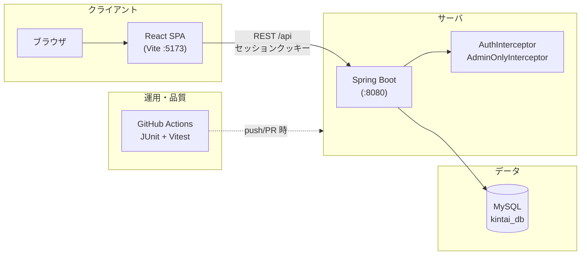
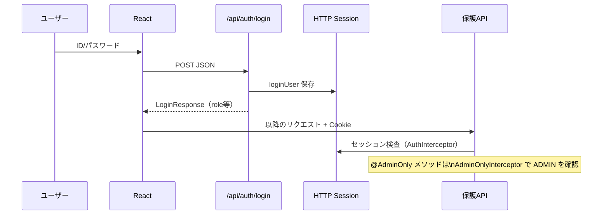
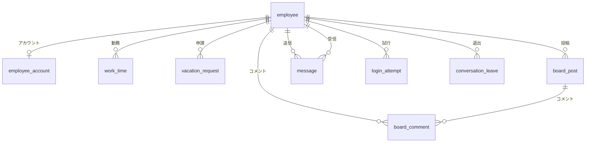

# kintai（勤怠管理システム）— システム設計概要（日本語版）

**文書目的**: 代表・社内レビュー向けに、**アーキテクチャ／認証・権限／役割／データ／API** を1ファイルで俯瞰できるよう整理します。  
**更新**: コード・要件が変わった場合は、本ドキュメントも併せて更新することを推奨します。  
**ダイアグラム**: [Mermaid](https://mermaid.js.org/) 記法です（GitHub/Notion/VS Codeプレビュー等でレンダリング可能）。

---

## 1. プロジェクト一言サマリ

| 項目 | 内容 |
|------|------|
| 名前 | kintai（勤怠）— 勤怠・社内協業 Webアプリケーション |
| 目的 | 教育・実務型プロトタイプ：従業員の勤務入力、管理者の集計・運用 |
| 構成 | **React(Vite)** SPA + **Spring Boot** REST API + **MySQL** |
| 認証 | HTTP **セッション**（`loginUser`）、役割 **ADMIN** / **EMPLOYEE** |

---

## 2. システム構成図

**ローカル開発**: フロントのプロキシで `/api` → バックエンドへ転送（`vite.config.js`）。

---

## 3. 認証・権限フロー（概念）

| 構成要素 | 役割 |
|-----------|------|
| `AuthInterceptor` | `/api/**` のうちログイン例外パス以外は **未認証 → 401** |
| `AdminOnlyInterceptor` | `@AdminOnly` 付きハンドラのみ **ADMIN以外 → 403** |
| フロント `PrivateRoute` | UIルーティングでログイン・管理者メニューを分岐（最終権限は **バックエンド**） |

---

## 4. 役割別 機能マトリクス

| 区分 | EMPLOYEE（従業員） | ADMIN（管理者） |
|------|---------------------|-----------------|
| 勤怠 | 勤務入力、本人履歴 | 全従業員照会、Excel、レポート、統計等 |
| 休暇 | 申請・取消・履歴 | 一覧・承認・却下 |
| 協業 | 掲示板、メッセンジャー | 同左（一部管理APIはADMIN） |
| その他 | — | 従業員マスタ、ログイン試行履歴、ダッシュボード等 |

**画面・APIメッセージ**: 主に **日本語**（詳細は `README_jp.md` / `README_kr.md`）。

---

## 5. 主要画面（ルート）概要

| パス | 対象 |
|------|------|
| `/login` | 共通 |
| `/work-input`, `/work-history` | 従業員 |
| `/menu`, `/employees`, `/work-view`, `/statistics`, `/dashboard`, `/upload`, `/attendance-import`, `/report`, `/login-check`, `/vacation-manage` | 管理者中心 |
| `/board`, `/board/:postId`, `/messenger`, `/vacation` | ログインユーザー |

（詳細: `frontend/src/App.jsx`）

---

## 6. APIグループ（代表）

| 領域 | Base path | 備考 |
|------|----------|------|
| 認証 | `/api/auth` | login, logout, me |
| 勤怠 | `/api/worktime` | 月次取得、CRUD、bulk、Excel取込（管理）、月次レポート送信 |
| 従業員・写真 | `/api/employees` | マスタCRUD、写真アップロード/取得 |
| 掲示板 | `/api/board` | 投稿・コメント |
| メッセンジャー | `/api/messenger` | 会話一覧、メッセージ、送信、未読、**会話から退出（非表示）** |
| 休暇 | `/api/vacations` | my、申請、取消、管理者一覧・承認・却下 |
| その他 | `/api/attendance`, `/api/reports`, `/api/statistics`, … | README/コントローラ参照 |

---

## 7. データ概要（ER：概念）

物理テーブル名・制約の正本は Flyway（`backend/src/main/resources/db/migration`）。以下は **エンティティ関係の概念**。

| エンティティ（テーブル） | 説明 |
|--------------------------|------|
| `employee` | 従業員マスタ |
| `employee_account` | ログインID・役割など |
| `work_time` | 日別勤務記録 |
| `vacation_request` | 休暇申請・承認状態 |
| `board_post` / `board_comment` | 掲示板 |
| `message` | 1:1メッセンジャー（`system_type` 等拡張余地） |
| `conversation_leave` | 会話一覧からの非表示（退出） |
| `login_attempt` | ログイン成功/失敗の監査 |
| `batch_import_history` | 一括取込履歴（該当時） |

---

## 8. 非機能・運用（要約）

| 項目 | 内容 |
|------|------|
| CI | `.github/workflows/tests.yml` — Gradle `test`, `npm test` |
| プロファイル | `dev` / `prod`（`application-*.properties`） |
| CORS | 開発: localhost:5173 等（`WebConfig`） |
| セキュリティ | パスワードハッシュ、セッション、管理APIの二重検証（Interceptor + Service） |

---

## 9. 関連ドキュメント・パス

| パス | 説明 |
|------|------|
| `README_kr.md` / `README_jp.md` | 機能・実行方法 |
| `sql/schema.sql` | 手動DDL参考 |
| `docs/` | 本ドキュメントおよび設計メモ |

---

## 10. 次に補強すると良い成果物（任意）

- シーケンス別 **詳細シーケンス図**（Excel取込、休暇承認 等）
- **デプロイ構成図**（Docker/クラウド導入時）
- **OpenAPI(Swagger)** の自動ドキュメント

---

*本ドキュメントはリポジトリの現状構成を基に作成されています。*

