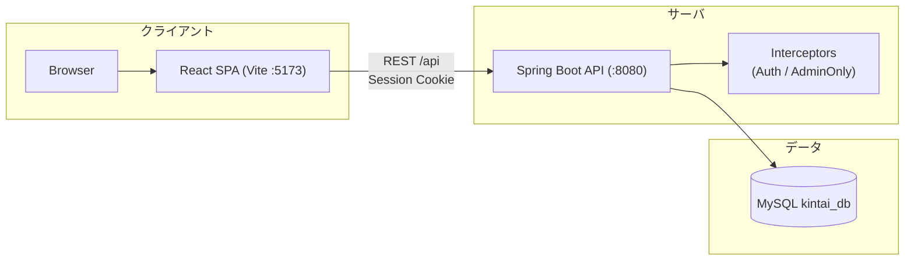
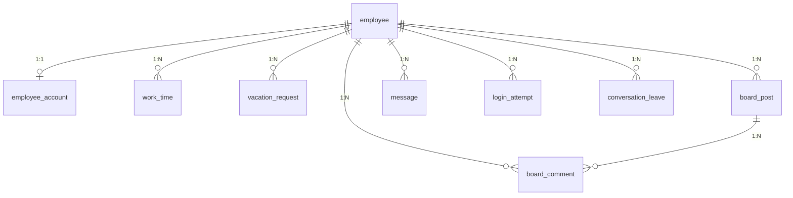

# 基本設計書（kintai／勤怠管理システム）

## 1. 文書情報

- **対象システム**: kintai（勤怠）— 勤怠管理 + 社内協業 Webアプリ
- **目的**: 要件を満たすための **全体方式・画面/機能構成・外部インタフェース・データ概要** を定義する
- **想定読者**: 開発者、レビュアー、テスト担当、運用担当
- **根拠（リポジトリ）**
  - `README_jp.md` / `README_kr.md`
  - `docs/system-design-overview.md`
  - `docs/モジュール_設計.md`
  - `docs/データ_設計.md`
  - `docs/インタフェース_設計.md`

---

## 2. システム概要

### 2.1 背景・目的

- 従業員の勤務情報（出退勤・休憩・備考）を月次で管理し、管理者が集計・運用できるようにする
- 教育・実務型プロトタイプとして、業務システムの設計〜実装〜テストの一連を経験する

### 2.2 想定ユーザーと権限

- **EMPLOYEE（従業員）**: 自分の勤怠・休暇、掲示板/メッセンジャー利用
- **ADMIN（管理者）**: 全従業員の照会・集計・取込・運用（社員マスタ、ログイン試行など）

---

## 3. 方式設計（全体アーキテクチャ）

### 3.1 システム構成

- **フロントエンド**: React（Vite）SPA（既定 `:5173`）
- **バックエンド**: Spring Boot REST API（既定 `:8080`）
- **DB**: MySQL（`kintai_db`）
- **CI**: GitHub Actions（backend: JUnit / frontend: Vitest）

### 3.2 認証・認可方式

- **認証**: HTTPセッション
  - ログイン成功時にセッションへ `loginUser` を保存し、以降の `/api/**` を保護
- **認可（権限）**: `ADMIN` / `EMPLOYEE`
  - `/api/**` のログイン強制: `AuthInterceptor`
  - 管理者専用の強制: `@AdminOnly` 相当（`AdminOnlyInterceptor`）
- **UI側の制御**: フロントのルーティングで、未ログインは `/login` へ誘導（最終防御はバックエンド）

### 3.3 開発時ネットワーク（プロキシ/CORS）

- 開発時はフロントが `/api` をバックエンドへプロキシ（`vite.config.js`）
- バックエンドは `/api/**` に対してローカルオリジンを許可（`WebConfig`、`allowCredentials=true`）

---

## 4. 画面（機能）構成

### 4.1 画面一覧（フロントルーティング）

`frontend/src/App.jsx` を基準に、代表ルートを列挙する。

#### 共通

- `/login`: ログイン
- `/board`, `/board/:postId`: 掲示板（投稿/閲覧/コメント）
- `/messenger`: 社内メッセンジャー
- `/vacation`: 休暇申請（自分の申請一覧）

#### 従業員（EMPLOYEE）

- `/work-input`: 勤怠入力
- `/work-history`: 勤務履歴

#### 管理者（ADMIN）

- `/menu`: メインメニュー
- `/employees`: 社員マスタ
- `/login-check`: ログイン試行の確認
- `/upload`: Excelアップロード（勤怠/勤務表の取込）
- `/attendance-import`: 勤怠取込（管理者画面）
- `/report`: 勤怠レポート／月次PDFプレビュー
- `/dashboard`: ダッシュボード
- `/work-view`: 勤務照会
- `/statistics`: 統計
- `/vacation-manage`: 休暇申請の管理（承認/却下）

### 4.2 主要ユースケース（業務フロー）

- **勤怠入力**: 従業員が月次の勤怠を登録/修正 → システム保存 → 月次確認
- **管理者集計**: 月単位で全体/従業員別に照会 → 統計/レポートで可視化
- **取込**: Excel等から勤怠データを取り込む（管理者/勤務表取込）
- **協業**: 掲示板・メッセンジャーで社内連絡
- **休暇**: 従業員申請 → 管理者が承認/却下

---

## 5. 外部インタフェース（API）概要

### 5.1 API方針

- Base path: **`/api`**
- データ形式: JSON（ファイルは `multipart/form-data`）
- セッション: Cookie（フロントは `axios` で `withCredentials=true`）

### 5.2 代表エンドポイント（概要）

- **認証**: `POST /api/auth/login`, `POST /api/auth/logout`, `GET /api/auth/me`
- **勤怠（WorkTime）**
  - `GET /api/worktime?month=YYYY-MM[&employeeId=...]`
  - `POST /api/worktime`, `PUT /api/worktime/{id}`, `DELETE /api/worktime/{id}`
  - `POST /api/worktime/bulk`（月間一括保存）
  - `POST /api/worktime/import-kintaihyo`（勤務表Excel取込、管理者）
  - `POST /api/worktime/send-monthly-report`（月次レポート送信）
- **社員マスタ（管理者）**: `/api/employees/*`
- **社員写真**: `POST /api/employees/{id}/photo`, `GET /api/employees/{id}/photo`
- **掲示板**: `/api/board/*`
- **メッセンジャー**: `/api/messenger/*`（未読件数: `GET /api/messenger/unread-count`）
- **休暇**: `/api/vacations/*`
- **統計/レポート**: `/api/statistics/*`, `/api/reports/*`

---

## 6. データ設計（概要）

スキーマの正本は Flyway（`backend/src/main/resources/db/migration`）。ここでは概念と主要テーブルを示す。

### 6.1 主要テーブル（例）

- `employee`: 従業員マスタ
- `employee_account`: 認証/権限（役割、パスワードハッシュ）
- `work_time`: 日別勤怠（従業員×日で一意）
- `vacation_request`: 休暇申請（状態: 申請/承認/却下 等）
- `board_post`, `board_comment`: 掲示板
- `message`, `conversation_leave`: メッセンジャー（会話の非表示/退出含む）
- `login_attempt`: ログイン試行（監査用途）

---

## 7. 非機能要件（方針）

### 7.1 性能

- 同時ユーザー少数（教育用想定）
- 月次一覧（1か月）を中心にAPIを設計

### 7.2 セキュリティ

- パスワードはハッシュ（Crypto）で保存（平文不可）
- セッション + インターセプタで API を保護
- 管理機能は `ADMIN` のみ許可（403を返す）

### 7.3 運用・保守

- DB変更はFlywayの履歴で管理
- CIでテストを自動実行し、品質ゲートとする
- 秘密情報は `application-local.properties` 等に分離（Gitに上げない運用を推奨）

---

## 8. 変更履歴

| 日付 | 版 | 内容 |
|---|---:|---|
| 2026-04-30 | 0.1 | リポジトリ現状から基本設計書を整形（初版） |

