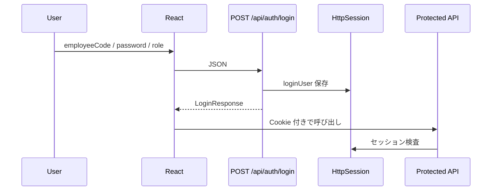
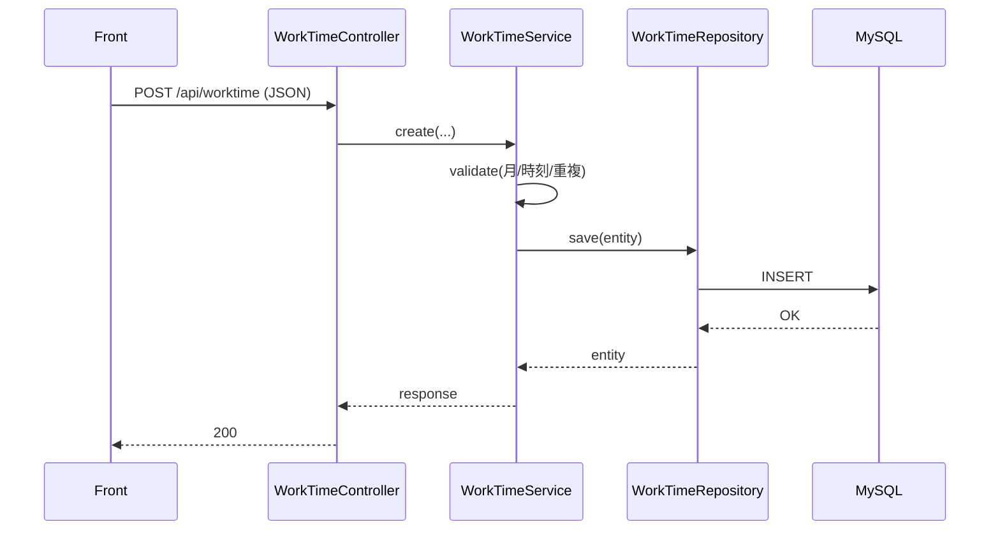

# 詳細設計書（kintai／勤怠管理システム）

## 1. 文書情報

- **対象システム**: kintai（勤怠）— 勤怠管理 + 社内協業 Webアプリ
- **目的**: 実装・テストが可能な粒度で、**API 仕様、データ定義、処理フロー、例外/エラー、権限制御** を定義する
- **根拠（リポジトリ）**:
  `docs/インタフェース_設計.md`（API 規約・DTO 例）, `docs/データ_設計.md`（ER・主要テーブル）, `docs/system-design-overview.md`（認証/権限・構成）, `README_jp.md`（主要機能・ルート・運用）

### 守備範囲（他文書との重複防止）

| 書く | 書かない（参照先） |
|------|---------------------|
| API のメソッド/パス/権限/エラー/入力、処理シーケンス、テスト観点、業務ルールの実装可能な記述 | ビジネス目的・スコープ → **`README_jp.md`** §6 要件定義 |
| | 技術スタックと画面一覧の地図 → **`基本設計書.md`** |
| | 代表向け俯瞰図 → **`system-design-overview_jp.md`** |

**4 種類の文書の役割一覧:** `docs/設計文書_役割_구분.md`

---

## 目次

1. [文書情報](#1-文書情報)
2. [実装方針](#2-実装方針レイヤ共通)
3. [認証・権限（詳細）](#3-認証権限詳細)
4. [API 詳細（主要）](#4-api-詳細主要)
5. [データ詳細（主要テーブル）](#5-データ詳細主要テーブル)
6. [主要処理フロー](#6-主要処理フロー例)
7. [テスト観点](#7-テスト観点詳細設計レベル)
8. [変更履歴](#8-変更履歴)

---

## 2. 実装方針（レイヤ・共通）

### 2.1 バックエンド（Spring Boot）

- レイヤ: Controller → Service → Repository（JPA）→ DB
- 例外: `@RestControllerAdvice` で JSON に統一（`{"error":"..."}` 等）
- DB 移行: Flyway（`backend/src/main/resources/db/migration`）

### 2.2 フロントエンド（React）

- ルーティング: `App.jsx` + `PrivateRoute`（未ログインは `/login` へ）
- API: `axios`（`baseURL: "/api"`, `withCredentials: true`）
- 401: セッション切れとしてログイン画面へ誘導

---

## 3. 認証・権限（詳細）

### 3.1 認証フロー（ログイン〜保護 API）

### 3.2 権限制御ルール

| 状況 | 結果 |
|------|------|
| 未認証アクセス | `AuthInterceptor` により 401 |
| 管理者専用 API を一般ユーザーが呼ぶ | `@AdminOnly`（`AdminOnlyInterceptor`）により 403 |
| 他人のデータへのアクセス | EMPLOYEE は自分のデータのみ、ADMIN は全体（各サービス実装に準拠） |

### 3.3 エラー応答（代表）

| コード | 形式 |
|--------|------|
| 200 | `{"message":"..."}` |
| 400 | `{"error":"..."}` |
| 401 | `{"error":"Unauthorized"}` またはログイン失敗メッセージ |
| 403 | `{"error":"管理者のみアクセスできます。"}` |

---

## 4. API 詳細（主要）

> Base path: `/api`  
> 完全な正本は Controller/DTO。本節は発表/テストで頻出の主要 API を整理する。

### 4.1 認証 `/api/auth`

#### ログイン

- **Method/Path**: `POST /api/auth/login`
- **Request**: `employeeCode`, `password`, `role`
- **Response**: `id`, `employeeCode`, `name`, `role`
- **失敗**: 401（メッセージ付き）

#### セッション確認

- **Method/Path**: `GET /api/auth/me`
- **仕様**: セッションがあれば 200 + `LoginResponse`、無ければ 401

---

### 4.2 勤怠 `/api/worktime`

#### 月次取得

- **Method/Path**: `GET /api/worktime?month=YYYY-MM[&employeeId=...]`
- **権限**: EMPLOYEE = 自分の月次 / ADMIN = `employeeId` 指定で従業員別も可
- **観点**: 月フォーマット不正は 400

#### 単件作成/更新/削除

| Method | Path |
|--------|------|
| POST | `/api/worktime` |
| PUT | `/api/worktime/{id}` |
| DELETE | `/api/worktime/{id}` |

**入力項目**: `workDate`, `startTime`, `endTime`, `breakMinutes`, `remarks?`

**業務ルール**:
- `(employee_id, work_date)` が一意（同一従業員×同一日付の重複は不可）
- `work_minutes` は開始/終了/休憩から算出・検証

#### 月間一括保存（bulk）

- **Method/Path**: `POST /api/worktime/bulk`
- **用途**: 月次をまとめて保存、上書きフラグあり

#### Excel 取込（勤務表）

- **Method/Path**: `POST /api/worktime/import-kintaihyo`
- **Content-Type**: `multipart/form-data`（`file`）
- **権限**: 管理者のみ
- **レスポンス**: 成功件数/失敗件数/エラー詳細行

#### 月次レポート送信

- **Method/Path**: `POST /api/worktime/send-monthly-report`
- **用途**: 従業員実行 → 管理者へ月次レポート送信

---

### 4.3 社員マスタ `/api/employees`（ADMIN）

| Method | Path | 用途 |
|--------|------|------|
| GET | `/api/employees` | 一覧取得 |
| POST | `/api/employees` | 登録 |
| PUT | `/api/employees/{employeeId}` | 更新 |
| POST | `/api/employees/batch-delete` | 一括削除 |
| PATCH | `/api/employees/{employeeId}/invite-email` | 招待メール設定 |
| POST | `/api/employees/{employeeId}/invite-email/send` | 招待メール送信 |

---

### 4.4 社員写真 `/api/employees/{id}/photo`

| Method | Path | 権限 |
|--------|------|------|
| POST | `/api/employees/{id}/photo` | ADMIN（multipart） |
| POST | `/api/employees/me/photo` | 本人 |
| DELETE | `/api/employees/me/photo` | 本人 |
| GET | `/api/employees/{id}/photo` | ログイン済みユーザー |

---

### 4.5 掲示板 `/api/board`

| Method | Path | 用途 |
|--------|------|------|
| GET | `/api/board` | 一覧 |
| POST | `/api/board` | 投稿 |
| GET | `/api/board/{postId}` | 詳細 |
| PUT | `/api/board/{postId}` | 編集 |
| DELETE | `/api/board/{postId}` | 削除 |
| POST | `/api/board/{postId}/comments` | コメント追加 |
| DELETE | `/api/board/{postId}/comments/{commentId}` | コメント削除 |

---

### 4.6 メッセンジャー `/api/messenger`

| Method | Path | 用途 |
|--------|------|------|
| GET | `/api/messenger/conversations` | 会話一覧 |
| GET | `/api/messenger/conversation/{partnerId}` | メッセージ取得 |
| POST | `/api/messenger/send` | 送信 |
| GET | `/api/messenger/unread-count` | 未読件数（メニューバッジ用） |
| POST | `/api/messenger/conversation/{partnerId}/delete` | 会話の非表示/退出 |

---

### 4.7 休暇 `/api/vacations`

#### 従業員

| Method | Path | 用途 |
|--------|------|------|
| GET | `/api/vacations/my` | 自分の申請一覧 |
| POST | `/api/vacations` | 申請 |
| DELETE | `/api/vacations/{requestId}` | 取消 |

#### 管理者

| Method | Path | 用途 |
|--------|------|------|
| GET | `/api/vacations?status=...` | 申請一覧 |
| PUT | `/api/vacations/{requestId}/approve` | 承認 |
| PUT | `/api/vacations/{requestId}/reject` | 却下 |

---

### 4.8 統計・レポート（ADMIN 中心）

- **統計**: `GET /api/statistics/monthly?month=YYYY-MM`
- **PDF**: `GET /api/reports/monthly.pdf?month=YYYY-MM`
  - ADMIN: 全体/従業員指定、EMPLOYEE: 本人範囲

---

## 5. データ詳細（主要テーブル）

> 詳細な定義は `docs/データ_設計.md` を正とする。

| テーブル | 主要制約 |
|----------|----------|
| `employee` | `employee_code` は一意、`active_flag` で有効/無効を制御 |
| `employee_account` | `employee` と 1:1（同一 PK）、`password_hash` は BCrypt、`role`: `ADMIN` / `EMPLOYEE` |
| `work_time` | 一意制約: `(employee_id, work_date)`、`work_minutes` は計算済み値（開始/終了/休憩の検証が必要） |
| その他 | `vacation_request`, `board_post`, `board_comment`, `message`, `conversation_leave`, `login_attempt` |

---

## 6. 主要処理フロー（例）

### 6.1 勤怠登録（単件）

### 6.2 月間一括保存（bulk）

- 受信した `items[]` を日付単位に検証
- `overwriteExisting=true` の場合、既存日を更新対象に含める
- 成功/失敗を集計してレスポンス

### 6.3 Excel 取込（勤務表/管理者取込）

- ファイル受領 → パース（POI 等）→ 行単位バリデーション → DB 反映
- 失敗行は件数と内容（`row`, `message`）を返却

---

## 7. テスト観点（詳細設計レベル）

| 領域 | 観点 |
|------|------|
| 勤怠 | 重複（同一日）、時刻整合（開始 < 終了）、休憩の範囲、月パラメータ形式 |
| 権限 | 未認証 → 401、一般ユーザーが管理者 API を叩いた場合 → 403 |
| 取込 | フォーマット不正、空欄、型の揺れ、部分成功時の集計 |

CI は `.github/workflows/tests.yml` で実行される。

---

## 8. 変更履歴

| 日付 | 版 | 内容 |
|---|---:|---|
| 2026-04-30 | 0.1 | リポジトリ現状から詳細設計書を整形（初版） |
| 2026-05-01 | 0.2 | 目次追加・表形式に整理 |
