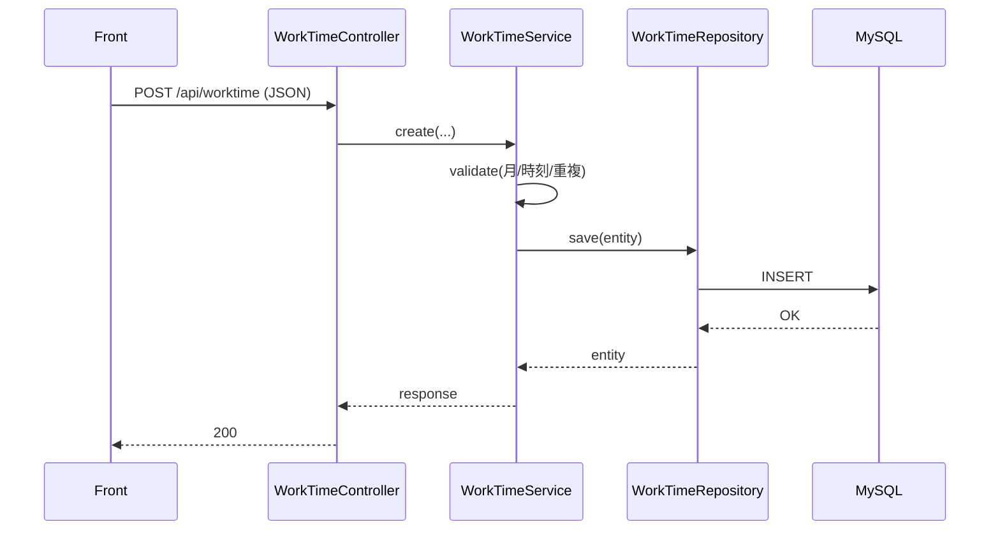

# 詳細設計書（kintai／勤怠管理システム）

## 1. 文書情報

- **対象システム**: kintai（勤怠）— 勤怠管理 + 社内協業 Webアプリ
- **目的**: 実装・テストが可能な粒度で、**API仕様、データ定義、処理フロー、例外/エラー、権限制御** を定義する
- **根拠（リポジトリ）**
  - `docs/インタフェース_設計.md`（API規約・一部DTO例）
  - `docs/データ_設計.md`（ER・主要テーブル）
  - `docs/system-design-overview.md`（認証/権限・構成）
  - `README_jp.md`（主要機能・ルート・運用）

---

## 2. 実装方針（レイヤ・共通）

### 2.1 バックエンド（Spring Boot）

- レイヤ: Controller → Service → Repository（JPA）→ DB
- 例外: `@RestControllerAdvice` で JSON に統一（`{"error":"..."}` 等）
- DB移行: Flyway（`backend/src/main/resources/db/migration`）

### 2.2 フロントエンド（React）

- ルーティング: `App.jsx` + `PrivateRoute`（未ログインは `/login` へ）
- API: `axios`（`baseURL: "/api"`, `withCredentials: true`）
- 401: セッション切れとしてログイン画面へ誘導（※ `/api/auth/me` 等は扱いに注意）

---

## 3. 認証・権限（詳細）

### 3.1 認証フロー（ログイン〜保護API）

### 3.2 権限制御ルール

- **未認証**: `AuthInterceptor` により 401
- **管理者専用**: `@AdminOnly`（`AdminOnlyInterceptor`）により 403
- **データ所有**: EMPLOYEEは自分のデータのみ、ADMINは全体（詳細は各サービス実装に準拠）

### 3.3 エラー応答（代表）

- 200: `{"message":"..."}`
- 400: `{"error":"..."}`
- 401: `{"error":"Unauthorized"}` またはログイン失敗メッセージ
- 403: `{"error":"管理者のみアクセスできます。"}`（代表）

---

## 4. API詳細（主要）

> Base path: `/api`  
> ここでは、発表/テストで頻出の主要APIを中心に整理する。完全な正本は Controller/DTO。

### 4.1 認証 `/api/auth`

#### 4.1.1 ログイン

- **Method/Path**: `POST /api/auth/login`
- **Request（例）**: `employeeCode`, `password`, `role`
- **Response（例）**: `id`, `employeeCode`, `name`, `role`
- **失敗**: 401（メッセージ付き）

#### 4.1.2 セッション確認

- **Method/Path**: `GET /api/auth/me`
- **仕様**: セッションがあれば 200 + `LoginResponse`、無ければ 401

---

### 4.2 勤怠 `/api/worktime`（別名 `/api/work-time`）

#### 4.2.1 月次取得

- **Method/Path**: `GET /api/worktime?month=YYYY-MM[&employeeId=...]`
- **権限**
  - EMPLOYEE: 自分の月次
  - ADMIN: `employeeId` 指定で従業員別も可
- **観点**
  - 月フォーマット不正は 400

#### 4.2.2 単件作成/更新/削除

- **POST** `/api/worktime`
- **PUT** `/api/worktime/{id}`
- **DELETE** `/api/worktime/{id}`

**入力項目（例）**
- `workDate`（日付）
- `startTime` / `endTime`
- `breakMinutes`
- `remarks?`

**代表的な業務ルール**
- `(employee_id, work_date)` が一意（同一従業員×同一日付の重複は不可）
- `work_minutes` は開始/終了/休憩から算出・検証

#### 4.2.3 月間一括保存（bulk）

- **Method/Path**: `POST /api/worktime/bulk`
- **用途**: 月次をまとめて保存、上書きフラグあり

#### 4.2.4 Excel取込（勤務表）

- **Method/Path**: `POST /api/worktime/import-kintaihyo`
- **Content-Type**: `multipart/form-data`（`file`）
- **権限**: 管理者実行（README記載に準拠）
- **レスポンス（例）**: 成功件数/失敗件数/エラー詳細行

#### 4.2.5 月次レポート送信

- **Method/Path**: `POST /api/worktime/send-monthly-report`
- **用途**: 従業員実行→管理者へ月次レポート送信（メール等）

---

### 4.3 社員マスタ `/api/employees`（ADMIN）

- **用途**: 従業員の登録/更新、招待メール、バッチ削除など
- **代表**
  - `GET /api/employees`
  - `POST /api/employees`
  - `PUT /api/employees/{employeeId}`
  - `POST /api/employees/batch-delete`
  - `PATCH /api/employees/{employeeId}/invite-email`
  - `POST /api/employees/{employeeId}/invite-email/send`

---

### 4.4 社員写真 `/api/employees/{id}/photo`

- **アップロード**: `POST /api/employees/{id}/photo`（ADMIN、multipart）
- **取得**: `GET /api/employees/{id}/photo`（ログイン済みなら取得可能）
- **留意**: 保存パス/上限/運用設定はプロパティ化して扱う（基本設計の運用方針）

---

### 4.5 掲示板 `/api/board`

- **一覧**: `GET /api/board`
- **投稿**: `POST /api/board`
- **詳細**: `GET /api/board/{postId}`
- **編集/削除**: `PUT/DELETE /api/board/{postId}`
- **コメント**: `POST /api/board/{postId}/comments`, `DELETE /api/board/{postId}/comments/{commentId}`

---

### 4.6 メッセンジャー `/api/messenger`

- **会話一覧**: `GET /api/messenger/conversations`
- **メッセージ取得**: `GET /api/messenger/conversation/{partnerId}`
- **送信**: `POST /api/messenger/send`
- **未読件数**: `GET /api/messenger/unread-count`（メニューのバッジ表示に利用）
- **会話の非表示/退出**: `POST /api/messenger/conversation/{partnerId}/delete` 等

---

### 4.7 休暇 `/api/vacations`

#### 従業員

- `GET /api/vacations/my`
- `POST /api/vacations`
- `DELETE /api/vacations/{requestId}`（取消）

#### 管理者

- `GET /api/vacations?status=...`
- `PUT /api/vacations/{requestId}/approve`
- `PUT /api/vacations/{requestId}/reject`

---

### 4.8 統計・レポート（ADMIN中心）

- **統計**: `GET /api/statistics/monthly?month=YYYY-MM`
- **PDF**: `GET /api/reports/monthly.pdf?month=YYYY-MM`
  - ADMIN: 全体/従業員指定
  - EMPLOYEE: 本人範囲

---

## 5. データ詳細（主要テーブル）

> 詳細な定義は `docs/データ_設計.md` を正とする。

### 5.1 `employee`

- 従業員コード（`employee_code`）は一意
- `active_flag` により有効/無効を制御

### 5.2 `employee_account`

- `employee` と 1:1（同一PK）
- `password_hash` はBCrypt等のハッシュ
- `role`: `ADMIN` / `EMPLOYEE`

### 5.3 `work_time`

- 1行=従業員×日付の勤怠
- 一意制約: `(employee_id, work_date)`
- `work_minutes` は計算済み値（開始/終了/休憩の検証が必要）

### 5.4 その他（概念）

- `vacation_request`, `board_post`, `board_comment`, `message`, `conversation_leave`, `login_attempt`

---

## 6. 主要処理フロー（例）

### 6.1 勤怠登録（単件）

### 6.2 勤怠 月間一括保存（bulk）

- 受信した `items[]` を日付単位に検証
- `overwriteExisting=true` の場合、既存日を更新対象に含める
- 成功/失敗を集計してレスポンス（取込系のUX改善点）

### 6.3 Excel取込（勤務表/管理者取込）

- ファイル受領 → パース（POI等）→ 行単位バリデーション → DB反映
- 失敗行は “何が何件失敗したか” が分かるように返却（`row`, `message`）

---

## 7. テスト観点（詳細設計レベル）

- **勤怠**: 重複（同一日）、時刻整合（開始<終了）、休憩の範囲、月パラメータ形式
- **権限**: 未認証401、一般ユーザーが管理者APIを叩いた場合403
- **取込**: フォーマット不正、空欄、型の揺れ、部分成功時の集計

CIは `.github/workflows/tests.yml` で実行される。

---

## 8. 変更履歴

| 日付 | 版 | 内容 |
|---|---:|---|
| 2026-04-30 | 0.1 | リポジトリ現状から詳細設計書を整形（初版） |

