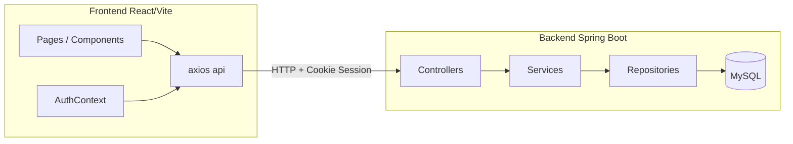

# 모듈 설계（勤怠管理システム）

본 문서는 **프론트엔드（React）**와 **백엔드（Spring Boot）**의 책임 분리·디렉터리 구조·주요 모듈 간 관계를 정리합니다.

---

## 1. 시스템 구성

- 개발 시 Vite가 `/api`를 `http://localhost:8080`으로 **프록시**합니다（`frontend/vite.config.js`）.
- API 호출은 `withCredentials: true`로 **서블릿 세션 쿠키**를 전송합니다.

---

## 2. 백엔드 모듈（`backend/src/main/java/com/kintai`）

### 2.1 레이어 구조

| 레이어 | 역할 | 대표 패키지 |
|--------|------|-------------|
| Web API | HTTP 라우팅, 세션·권한 위임, JSON 응답 | `controller` |
| 애플리케이션 서비스 | 트랜잭션 단위 비즈니스 로직 | `service` |
| 영속성 | JPA 쿼리·엔티티 접근 | `repository`, `entity` |
| 외부 계약 | 요청/응답 형식 | `dto` |
| 횡단 관심 | 인증·CORS·관리자 전용 URL | `config`, `auth`, `session` |
| 부가 | PDF 생성, 예외 처리, 유틸 | `pdf`, `exception`, `util`, `web` |

### 2.2 컨트롤러（API 진입점）

| 클래스 | `RequestMapping` | 비고 |
|--------|------------------|------|
| `AuthController` | `/api/auth` | 로그인/회원가입/로그아웃/세션 조회 |
| `EmployeeController` | `/api/employees` | 클래스 단위 `@AdminOnly` |
| `WorkTimeController` | `/api/worktime`, `/api/work-time` | 스태프·관리자 공통（경로 별칭） |
| `AttendanceController` | `/api/attendance` | `@AdminOnly`（Excel 取込・設計書パス） |
| `StatisticsController` | `/api/statistics` | `@AdminOnly` |
| `ReportController` | `/api/reports` | 역할에 따라 PDF 범위 분기 |

### 2.3 서비스

| 클래스 | 책임 |
|--------|------|
| `AuthService` | 회원가입, 로그인, 비밀번호 검증 |
| `WorkTimeService` | 월별 조회, 단건 CRUD, 벌크 upsert, 직원별 권한 |
| `AttendanceImportService` | Excel / 勤務表フォーマット 파싱 및 `work_time` 반영 |
| `StatisticsService` | 월별 집계（전사 / 개인） |

### 2.4 저장소

| 인터페이스 | 엔티티 |
|------------|--------|
| `EmployeeRepository` | `Employee` |
| `EmployeeAccountRepository` | `EmployeeAccount` |
| `WorkTimeRepository` | `WorkTime` |
| `BatchImportHistoryRepository` | `BatchImportHistory` |

### 2.5 인증·권한

| 구성요소 | 역할 |
|----------|------|
| `AuthInterceptor` | `/api/**` 중 예외 경로를 제외하고 **로그인 세션** 필수 |
| `AdminOnlyInterceptor` | `@AdminOnly`가 붙은 핸들러는 **ADMIN**만 통과 |
| `LoginSessionSupport` | 세션 속성 `loginUser`（`LoginResponse`）조회 |
| `ApiExceptionHandler` | API 예외의 JSON 형식 통일（필요 시 확장） |

**인증 예외（AuthInterceptor）:**  
`/api/auth/login`, `/register`, `/logout`, `/me` — `me`는 인터셉터 밖에서 호출 가능하나, 컨트롤러에서 미인증 시 401 처리.

### 2.6 기타

- **`dto/mapper`**: 엔티티 ↔ API 응답 매핑（예: `WorkTimeMapper`）.
- **`pdf`**: OpenPDF 기반 월간 PDF（`ReportController`）.
- **`util`**: 근무 시간 표시 문자열 등（`WorkTimeFormatUtil`）.

---

## 3. 프론트엔드 모듈（`frontend/src`）

### 3.1 디렉터리 역할

| 경로 | 역할 |
|------|------|
| `pages/` | 화면 단위（로그인, 勤務入力, 管理画面） |
| `pages/admin/` | 관리자 전용（ダッシュボード, 統計, 従業員マスタ 등） |
| `pages/employee/` | 스태프용（勤務入力, 勤務履歴） |
| `components/` | 공통 UI（`Layout`, `MonthPickerCard`, 取込カード 등） |
| `api/` | Axios 인스턴스·도메인별 API 래퍼（`api.js`, `worktime.js`, `attendance.js`） |
| `context/AuthContext.jsx` | 로그인 상태, `me` 조회, 로그아웃 |
| `hooks/` | 월 상태, 월별 근무 데이터 등 재사용 로직 |
| `utils/` | 시간 포맷 등 순수 함수 |

### 3.2 라우팅（`App.jsx`）

- 비로그인: `/login`, `/register`.
- 로그인 후: `Layout` 하위에 역할별 라우트（`PrivateRoute`, `adminOnly`）.
- 관리자 기본 경로 `/dashboard`, 스태프 `/work-input`.

### 3.3 UI·상태

- 전역 스타일: `index.css`（`.page-container`, `.card`, `.data-table` 등）.
- 레이아웃·푸터: `Layout.jsx` + `Layout.css`.

---

## 4. 주요 유스케이스 ↔ 모듈

| 유스케이스 | 프론트 | 백엔드 |
|------------|--------|--------|
| 로그인/로그아웃 | `Login.jsx`, `AuthContext` | `AuthController`, `AuthService` |
| 월별 근무 입력·수정 | `WorkInput.jsx`, `worktime.js` | `WorkTimeController`, `WorkTimeService` |
| 월별 벌크 저장 | `WorkInput.jsx` | `POST .../bulk` |
| 勤務表 Excel 取込（本人） | `KintaihyoImportCard` 등 | `WorkTimeController#importKintaihyo` |
| 관리자 Excel 取込 | `AttendanceImport` | `AttendanceController` |
| 통계·대시보드 | `Dashboard`, `Statistics` | `StatisticsController`, `StatisticsService` |
| PDF | `Statistics` 버튼 | `ReportController` |
| 직원 마스터 | `EmployeeMaster` | `EmployeeController` |

---

## 5. 문서 관리

| 일자 | 내용 |
|------|------|
| 2026-04-14 | 초안 작성 |
