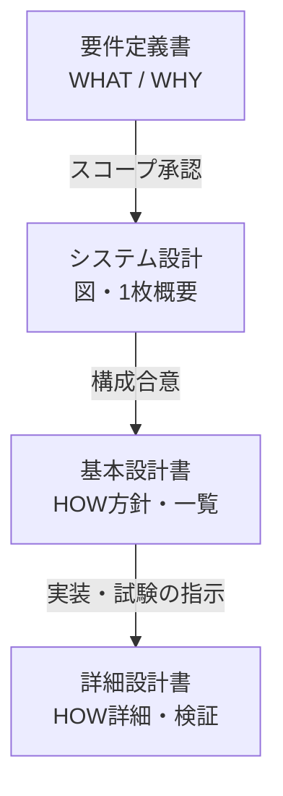

# 설계·요건 문서의 역할 구분（非重複ガイド）

**목적:** 요건정의서·시스템 설계(개요/図)·기본설계서·상세설계서가 **같은 내용을 반복하지 않도록** 역할을 나누고, 한눈에 보이게 요약합니다.  
**適用:** 본 리포지토리의 Markdown 設計書および、研修用 Word（`docs/トレーニングシステム/*.docx`）を整理するときの基準にも使えます。

---

## 1. 네 가지 문서 — 한 줄 정의

| 문서（日本語名） | 한 줄 | “여기까지”가 책임 |
|------------------|-------|---------------------|
| **요건정의서**（要件定義書） | **무엇을·왜** 달성할지（ビジネス） | 목표、スコープ、利用者、機能一覧（**名前レベル**）、受入条件、非機能の**目標値** |
| **시스템 설계**（システム設計／概要・構成図） | **전체를 한 장에**（コミュニケーション） | 利用者↔画面↔サーバ↔DB の関係、認証の**概念**（用語だけ） |
| **기본설계서**（基本設計書） | **어떤 방식으로**満たすか（アーキ方針） | 技術スタック、画面/ルート一覧、API **グルーピングと代表パス**、ER **概要**、運用方針 |
| **상세설계서**（詳細設計書） | **구현·테스트 가능**한 단위 | HTTP メソッド/パス/Body/権限/エラー、業務ルール、シーケンス、テスト観点、DB **列レベル**は別紙へ |

---

## 2. 겹치지 않게 — “넣을 것 / 넣지 말 것”

| 주제 | 요건정의서 | 시스템 설계 | 기본설계서 | 상세설계서 |
|------|------------|-------------|------------|------------|
| 비즈니스 목적·배경 | ◎ 主 | △ 1文まで | × | × |
| “로그인한다” 수준의 기능名 | ◎ | × | △ 画面と対応づけのみ | × |
| React / Spring / MySQL 等の技術選定 | × | △ 図のラベルのみ | ◎ | ×（既定として参照） |
| 構成図・認証の**概念**図 | × | ◎ **正本（短）** | △ 必要ならリンク | × |
| 画面 URL 一覧 | × | × | ◎ | ×（異常系ルーティングのみ必要なら△） |
| API をカテゴリ別に列挙 | × | × | ◎ **概要** | × |
| メソッド/パス/パラメータ/レスポンス例 | × | × | × | ◎ **正本** |
| ER 図（エンティティ名のみ） | × | △ | ◎ **概要** | × |
| テーブル定義（列・型・制約） | × | × | × | ◎ → **`データ_設計.md` / Flyway** を正と明記 |
| 業務ルール（重複禁止・計算式） | ◎ 要求として | × | △ 方針1行 | ◎ **検証可能な記述** |
| 例外コード・Interceptor 挙動 | × | × | △ 方針 | ◎ |
| テスト観点（境界値） | △ 受入観点 | × | × | ◎ |

**記号:** ◎ = 主担当 / △ = 最小限だけ / × = 書かない（他文書へ誘導）

---

## 3. 이 레포지토리 파일 매핑

| 역할 | 리포지토리内の参照先 | 비고 |
|------|---------------------|------|
| 요건（教育シナリオ含む） | `README_jp.md`（付録）, `docs/トレーニングシステム/711...要件定義.docx` 等 | Word が正式な研修提出物の場合は **Word を正**とし、README は要約のみ |
| 시스템設計（代表向け・短） | `docs/system-design-overview.md`（韓）, `docs/system-design-overview_jp.md`（日） | **図と用語**中心。API の列挙は基本設計へ誘導 |
| 기본設計 | `docs/基本設計書.md` | API は「代表パス」のみ。列挙の拡張は詳細 or `インタフェース_設計.md` |
| 상세設計 | `docs/詳細設計書.md`, `docs/インタフェース_設計.md`, `docs/データ_設計.md`, `docs/モジュール_設計.md` | **API/DB の詳細の正本**はここ群＋コード |
| 実装との同期 | `backend/.../controller`, Flyway migration | ドキュメントが食い違うときは **コード優先**で文書を直す |

---

## 4. 運用ルール（重複を減らす）

1. **同じ図を3ファイルに貼らない** — 代表向けは `system-design-overview_*` のみ。基本設計で図が必要なら「概要図は system-design を正」と1行でよい。
2. **API の完全列挙は1か所** — 詳細設計（＋インタフェース設計）。基本設計はカテゴリ＋代表例のみ。
3. **テーブル列定義は1か所** — `データ_設計.md` または DDL（Flyway）。詳細設計は「主要制約＋リンク」まで。
4. **要件定義に技術名を増やさない** — 例外：「ブラウザで利用」など利用環境の要求だけ。

---

## 5. 超要約（上司・非開発向け）

- **要件定義書** … お客様／教育担当が「何ができれば OK か」を決める紙。  
- **システム設計（図）** … 部品がどうつながるかを会議で見せる 1 枚。  
- **基本設計書** … 開発チームが「画面と API と DB の全体地図」を共有する紙。  
- **詳細設計書** … プログラマとテストが、そのまま実装・試験に使う細かい仕様。

---

## 6. 変更履歴

| 日付 | 内容 |
|------|------|
| 2026-05-01 | 初版：4文書の役割分担・リポジトリ対応表を追加 |
